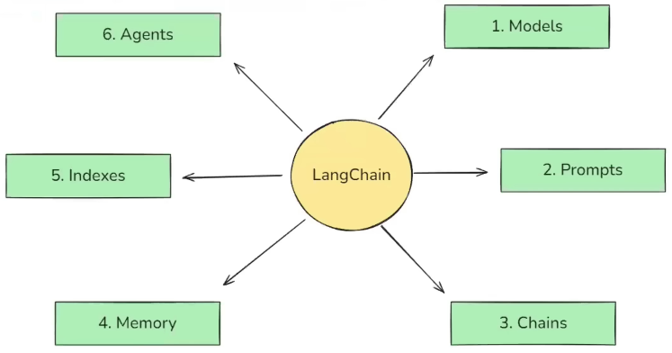
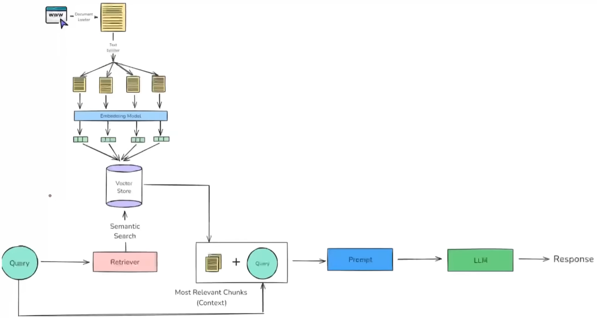

# Langchain Notes

---

## 1. Models

### 1.1 Language Models

- **LLMs** (legacy / slowly deprecated)
  - String input → String output
- **Chat Models** (preferred)
  - OpenAI
  - Anthropic
  - Google Gemini
  - Hugging Face (LLaMA, Mistral, etc.)

### 1.2 Embedding Models

- OpenAI
- Anthropic
- Google Gemini
- Hugging Face (MiniLM, etc.)

### Model Access Types
- **Open models**: Open-source, HF API or local download
- **Closed models**: Paid APIs only

---

## 2. Prompts

### 2.1 Single Message (Single-turn)

- Static Prompts
- Dynamic Prompts (`PromptTemplate`)

### 2.2 Multi-Message (Chat / Multi-turn)

- Static Messages  (`SystemMessage`, `HumanMessage`, `AIMessage`)
- Dynamic Prompts  (`ChatPromptTemplate`)
  - `MessagesPlaceholder`

---

## 3. Output Handling

### 3.1 Structured Outputs (`with_structured_output`)

- **TypedDict**
  - Type hints only, no validation
- **Pydantic**
  - Validation + defaults
- **JSON Schema**
  - Best for multi-language interoperability

> Output modes:  
> `json_mode` (OpenAI default)  
> `function_mode` (Claude / Gemini default)

---

### 3.2 Output Parsers

- Used when model output is **unstructured**
- Works with any LLM

Common parsers:
- `StrOutputParser`
- `JsonOutputParser`
- `PydanticOutputParser`

---

## 4. Chains & Runnables

### 4.1 Chains
- Simple Chain - LCEL (LangChain Expression Language)
- Sequential Chain - Series chain with multiple llm stages
- Parallel Chains 
- Conditional Chains

### 4.2 Runnables

Why:
- Unified abstraction for execution
- Composable & async-friendly

Types:
- `RunnableSequence`
- `RunnableParallel`
- `RunnablePassthrough`
- `RunnableLambda`
- `RunnableBranch`
- Many more

---

## 5. Memory

- Traditional memory → **being phased out**
- Recommended approach: **LangGraph state**

---

## 6. Document Loaders

- `load()` - single complete load **vs** `lazy_load()` - stream load

Common loaders:
- `TextLoader`
- `PyPDFLoader`
- `DirectoryLoader`
- `WebBaseLoader`
- `CSVLoader`

---

## 7. Text Splitters

- Length-based  
  (`CharacterTextSplitter`)
- Text-structure-based  
  (`RecursiveCharacterTextSplitter`)
- Document-structure-based  
  (`from_language` → Markdown, Python, etc.)
- Semantic (embedding-based)

---

## 8. Vector Stores

- Vector **store** vs Vector **database** - VD are VS with some DB properties, like ACID, etc
- Examples:
  - Chroma
  - FAISS
  - Pinecone
---

## 9. Retrievers

### 9.1 Source-Based

- Wikipedia Retreiver, 
- Vector Store Retreiver (vector_store.as_retriever)- similar to normal vectore store extraction, but can be used for custom retreival strategies
- Archxiv Retriver, etc

### 9.2 Search Strategy-Based

- MMR(Maximum Marginal Relevance)
- **Multi-Query Retriever**
  - LLM generates multiple queries to reduce ambiguity
- **Contextual Compression**
  - Compress retrieved docs to relevant parts only
- Many more

---

## 5. RAG

## 10. RAG (Retrieval Augmented Generation)

Why:
- Overcomes LLM limitations:
  - Private data
  - Knowledge cutoff
  - Hallucinations

### Learning Approaches
- Fine-tuning
  - SFT, Continued Pre-training
  - LoRA / QLoRA / RLHF
- In-context learning  
  (“Large Models are Few-Shot Learners”)

### RAG Pipeline
1. Indexing  
   (Load → Split → Embed → Store)
2. Retrieval
3. Augmentation
4. Generation

---

## 11. Tools

### 11.1 Built-in Tools
- DuckDuckGoSearch
- Wikipedia
- Python REPL
- Shell
- SQL tools
- API / Request tools

### 11.2 Custom Tools
- `@tool`
- `StructuredTool`
- `BaseTool`

### 11.3 Tool Flow
- Toolkits
- Tool Binding
- Tool Calling
- Tool Execution

---

## 12. Agents

- Agent (decision maker)
- Agent Executor (runtime loop)

> Agents + memory + control flow → **LangGraph**

---

